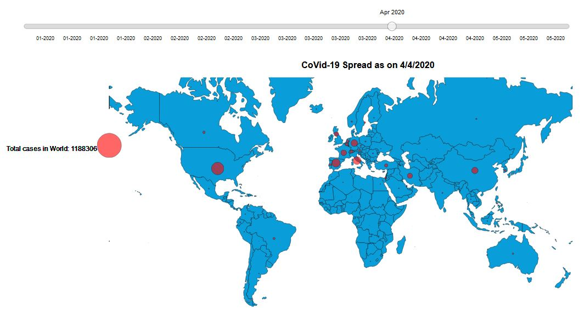
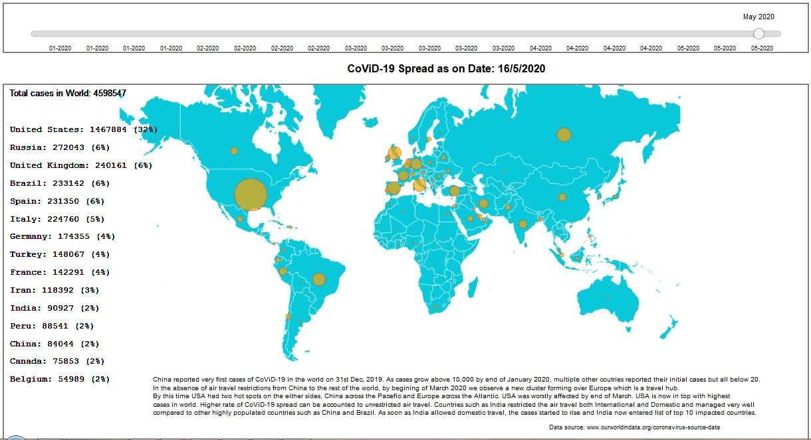

# Make-Effective-Data-Visualization

Udacity Project on Data Visualization with D3.js for AIRBUS Data Analyst Nanodegree Program.

**Title**: CoViD-19 Spread around the World  
**Author**: Pankaj NATH

`File Name`|`Issue`|`Date`|`Reason for Revision`
-----------|-------|------|---------------------
index_final.html|v1.0|30th May, 2020|First submission
  
## Summary  
  
We all live in a truly connected world and CoViD-19 Pandamic has hit this world really bad. It all started with first reported case from China on the new year's eve and has impacted countries from every corner of this world. Through this animation and associated data, the spread of CoViD-19 in terms of total positive cases around the world is visualized. The spread and impact of CoViD-19 followed the route of travel via different air transport hubs and then spreading internally within impacted countries.  
  
  
## Design  
  
We are living through this pandamic period and their are multiple Covid related visualization available on the internet. I found many such visualization and found myself referring to them like all others for keeping track of its impact. During this data visualization course I felt the urge to implement my learning and create a visualization of my own to capatilize my learning. My first objective was to achieve a simple visualization first using what I learned during the course. Starting small and then adding smaller bricks on top of one another to achieve incremental targets. To visualize the spread of CoViD-19, the base of my canvas has to be the world map. Over the map, I plotted each impacted country with a single circle. The measure of impact for each country is encoded by the size (radius) of the circle. The larger the circle, the higher is total positive cases.  
  
Once I achieved this stage, then I included the animation showing the evolution of circle size for each impacted country with each passing day. This was possible due to the time-series nature of data. Next I have added a slider for the user as a mode of interaction by selecting any particular date and simulating the circles on the map.  
  
I have implemented the martini glass narrative style in my visualization. When the visualization is loaded, the first instance shows the impact map for last date datapoint. This acts as a base of my glass. Next is the animation where I showed the evolution of total cases and spread of CoViD-19 from first reported case onwards. This acts as the narrow stem of the martini glass. At the end of animation, slider appears for the user to start interacting with the visualization. This final part enacts as the open channel for user to interact.  
  
At this stage I hosted my data vizualization via GitHub and requested my colleagues for their feedback. Find below the screenshot of visualization on which I recieved feedbacks.  
  
  
  
### Feedbacks  
I recieved feedbacks from 8 of my colleagues and then implemented some of them into my work to improve my intended visualization. I list below the recieved feedbacks in two categories based upon if those were implemented or not.  
  
#### Implemented improvements and their inspiration  
* The slider and map canvas was aligned properly for better display.  
* The speed of animation was increased since to quickly cover the complete range of dates. With addition of slider now user can navigate to any date as required.  
* The big red legend circle on the left side of map showing total cases in the whole world was removed since it created some confusion due to its positioning and rendering during animation.  
* A list of top-15 impacted countries was included on the left side in terms of total cases. Also tool tip was added to show the data when mouse pointer is hovered above any impacted country.  
* The color fill for impact circle and countries in map along with border line thickness of the map was changed to improve readability of tool tips.  
* The source of data is added at the bottom of the canvas since this point was raised in two different feedback for credibility reasons.  
  
#### Feedbacks not implemeted  
* A feedback was to include bar graphs of impacted countries. I faced problems appending HTML table or bar chart to svg container. Considering the rapid speed of animation I felt the same information is cascaded nicely by new text legend.  
* Another feedback was to provide option to adjust the animation speed. Considering that users were not aware how long the animation will play, it is best for the author to decide this speed and user can always simulate using slider. Implementing this could also break the martini galss narrative which I was able to achieve.  
* Another feedback was to encode the total cases using color hues (as in heat maps). This was not implemented since colour hues are ranked lower than area (like circle size) in terms of accuracy of visual encodings.  

#### Final Visualization  
After implenting the above feedbacks as discussed, I also incorporated the percentage of total cases of individual countries into the legend and tool tip. Also along with the data source, I added  some explanatory text. Asthetically, I included the map and slider in two different border boxes. Below is the screenshot of my final visualization.  
  
  

### Resources  
Covid Data source: [https://ourworldindata.org/coronavirus-source-data]  
Countries latitude and longitude: [https://developers.google.com/public-data/docs/canonical/countries_csv]  
JSON World map file: [https://geojson-maps.ash.ms/]  
Basic bubble map in d3.js: [https://www.d3-graph-gallery.com/graph/bubblemap_basic.html]  
Building tooltips with d3.js: [https://www.d3-graph-gallery.com/graph/interactivity_tooltip.html]  
How to create a simple tooltip in d3: [https://mappingwithd3.com/tutorials/basics/tooltip/]  
  
